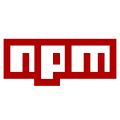

# npmjs-server

A simple private npm registry running on Node.js.



[](https://www.repostatus.org/#wip)
[](https://opensource.org/licenses/MIT)
[](https://www.npmjs.com/package/npmjs-server)
[](https://hub.docker.com/r/kekyo/npmjs-server)

[日本語のドキュメントはこちら。](./README_ja.md)

---

## What is this?

A server for storing and distributing npm packages within an organization or for personal use. Standard npm clients can publish, search for, and install packages.

Packages and user information are stored in files, so no database is required. Both scoped and unscoped packages are supported.

A browser-based administration UI is also provided:

- Browse packages, versions, READMEs, and other package information.
- Download a specific package version.
- Publish multiple `.tgz` files using drag and drop.
- Add or delete users, change passwords, and reset user passwords.
- View and revoke npm tokens, and configure two-step authentication.

### Key Features

- npm client support, including `npm publish`, `npm install`, `npm search`, and `npm dist-tag`.
- File-based storage without a database.
- Three authentication modes: no authentication, authentication for publishing, or authentication for both reading and publishing.
- Optional two-step authentication per user, with QR registration, authenticator codes, and recovery codes.
- Read-only upstream npm registry proxying with package caching.
- Reverse proxy support through a fixed public URL or forwarded headers.
- Run with Docker or Podman.

## System Requirements

Node.js 20.19.0 or later is required. The administration UI is available in a browser.

When running a container, you do not need to install Node.js on the host. See [Using Docker](#using-docker).

## Installation

```bash
npm install -g npmjs-server
```

## Usage

```bash
# Start on the default port, 4873
npmjs-server

# Use a different port
npmjs-server --port 3000

# Specify the configuration file and package directory
npmjs-server --port 4873 --config-file ./config.json --package-dir ./packages
```

Open `http://localhost:4873/` in a browser to use the administration UI. If you changed the port, use that port instead.

Authentication is disabled by default, allowing anyone to read and publish packages. Configure [Authentication](#authentication) to restrict access.

## npm Client Configuration

You can specify the registry for each command:

```bash
npm install your-package --registry http://localhost:4873/
npm view your-package --registry http://localhost:4873/
npm search your-package --registry http://localhost:4873/
```

To make it your default registry, update the npm configuration:

```bash
npm config set registry http://localhost:4873/
```

For a project-specific setting, save the following in the project's `.npmrc`:

```ini
registry=http://localhost:4873/
```

To use this server only for a particular scope, use this setting instead:

```ini
@myorg:registry=http://localhost:4873/
```

With this configuration, `@myorg/example` comes from npmjs-server, while other packages use npm's default registry. See the [official npm documentation](https://docs.npmjs.com/cli/v11/configuring-npm/npmrc/) for details about `.npmrc`.

If npmjs-server is your registry for all packages, enable the [Upstream npm Registry Proxy](#upstream-npm-registry-proxy) to also retrieve packages from npmjs.org.

### Publishing Packages

When authentication is enabled, log in first. Both browser login and terminal login are supported:

```bash
npm login --registry http://localhost:4873/

# Log in within the terminal instead
npm login --auth-type=legacy --registry http://localhost:4873/
```

Run the following in the package directory:

```bash
npm publish --registry http://localhost:4873/
```

You can also publish a `.tgz` file created with `npm pack`:

```bash
npm publish ./example-package-1.0.0.tgz --registry http://localhost:4873/
```

In the administration UI, open "Upload Package" to select files or drag and drop multiple `.tgz` files.

If the same package name and version already exist, the server keeps the existing package by default. Set `duplicatePackagePolicy` to `overwrite` to replace it, `ignore` to keep it, or `error` to reject the upload.

The default upload request limit is 100 MB. Change it with `maxUploadSizeMb`. Because `npm publish` embeds the archive as Base64 in JSON, the limit must accommodate a request larger than the archive itself.

## Package Storage Configuration

### Storage Location

By default, packages are stored in `./packages` relative to the working directory. Change this with `--package-dir`, the `NPMJS_SERVER_PACKAGE_DIR` environment variable, or `packageDir` in `config.json`.

```bash
npmjs-server --package-dir /srv/npmjs-server/packages
```

### Package Storage Layout

```text
packages/
  package-name/
    1.0.0/
      package.json
      metadata.json
      package-name-1.0.0.tgz
    dist-tags.json
  @scope/
    package-name/
      1.0.0/
        package.json
        metadata.json
        package-name-1.0.0.tgz
      dist-tags.json
```

Archives and package information are stored per version. `dist-tags.json` is created when tags are explicitly saved. Packages fetched through the proxy are stored separately in `proxy.packageDir`.

### Backup and Restore

Stop the server, then back up the following files and directories together:

- The package directory specified by `packageDir`.
- `config.json` and any separately managed settings, such as environment variables.
- `users.json` if authentication is enabled.
- `totp.key` if two-step authentication is enabled.
- `proxy.packageDir` if you want to preserve the proxy cache.

To restore a backup, stop the server, restore the files, check the configured paths and permissions, and restart. Include any custom storage locations in your backup. Both the user information and the encryption key are required for enrolled TOTP accounts.

## Configuration

Settings take precedence in this order: CLI options, environment variables, `config.json`, and defaults. Some settings are available through only certain methods. See the [Configuration Reference Table](#configuration-reference-table).

If `config.json` does not exist, the server uses defaults. It does not create a configuration file automatically.

## Configuration File Structure

By default, the server reads `./config.json` in the working directory. Use a CLI option or environment variable to select another location:

```bash
npmjs-server --config-file /srv/npmjs-server/data/config.json

# Use an environment variable instead
NPMJS_SERVER_CONFIG_FILE=/srv/npmjs-server/data/config.json npmjs-server
```

Relative paths inside the configuration file are resolved against the directory containing `config.json`. Relative paths supplied through CLI options or environment variables use the working directory.

### config.json Structure

All settings are optional. The following example requires authentication for publishing. Create an administrator as described under [Initialization](#initialization) before starting the server.

```json
{
  "port": 4873,
  "packageDir": "./packages",
  "usersFile": "./users.json",
  "realm": "Private npm registry",
  "logLevel": "info",
  "authMode": "publish",
  "passwordMinScore": 2,
  "passwordStrengthCheck": true,
  "duplicatePackagePolicy": "ignore",
  "maxUploadSizeMb": 100,
  "totpKeyFile": "./totp.key",
  "proxy": {
    "enabled": false,
    "upstreamRegistry": "https://registry.npmjs.org",
    "packageDir": "./proxy-packages"
  }
}
```

The configuration file must be valid JSON. Comments and trailing commas are not supported.

## Authentication

Use `authMode` to control access to packages:

| Mode | Reading, searching, and downloading | Publishing and changing tags |
| --- | --- | --- |
| `none` (default) | No authentication | No authentication |
| `publish` | No authentication | Requires the `publish` or `admin` role |
| `full` | Login required | Requires the `publish` or `admin` role |

Login pages and health checks remain accessible without authentication in `full` mode. Administrative operations, such as user management, require login and the appropriate permissions.

### Initialization

Create the first administrator account:

```bash
npmjs-server --config-file ./config.json --auth-init
```

Enter the username, password, and password confirmation when prompted. By default, `users.json` is created next to `config.json`. An existing user file is not overwritten.

This command exits after creating the account. It does not change the authentication mode or start the server. Set `authMode` in the configuration file or start the server as follows:

```bash
npmjs-server --config-file ./config.json --auth-mode publish
```

### Example Session

```text
$ npmjs-server --auth-init
Enter admin username: admin
Enter password: ********
Confirm password: ********
```

After initialization, start the server and log in with the new account through the browser or npm client:

```bash
npm login --registry http://localhost:4873/
npm whoami --registry http://localhost:4873/
```

### User Management

Administrators can add or delete users and reset their passwords through the administration UI. Each user can change their own password.

| Role | Allowed operations |
| --- | --- |
| `read` | Read, search for, and download packages |
| `publish` | All `read` operations, plus publishing packages and changing tags |
| `admin` | All `publish` operations, plus user management |

Roles apply across the registry. Package-specific, organization, and team permissions are not supported. `npm login` does not create accounts; an administrator must register users beforehand.

### Two-step Authentication (TOTP)

When `authMode` is `publish` or `full`, each user can enable two-step authentication. It is disabled by default.

1. After logging in, open "Two-step authentication" from the user menu at the top right.
2. Enter your current password and select "Register authenticator".
3. Scan the QR code with your authenticator app, or enter the manual setup key.
4. Enter the six-digit code from the app to enable two-step authentication.
5. Save the ten recovery codes somewhere safe. They cannot be displayed again after you close this screen.

The QR code is generated locally in the browser. Use an authenticator app supporting TOTP as defined in [RFC 6238](https://www.rfc-editor.org/rfc/rfc6238.html), with SHA-1, six digits, and a 30-second interval.

Once enabled, login requires both your password and an authenticator code. A code cannot be reused; wait for the next code before authenticating again.
The verification challenge expires after five minutes and allows five attempts. Repeated failures trigger per-user and per-IP limits of up to ten minutes.
Keep the server and authenticator clocks synchronized, and use HTTPS for public deployments.

If you lose your device, select "Use a recovery code" on the verification screen. Each recovery code can be used once. Registering a replacement authenticator after login requires another unused authenticator or recovery code.

The two-step authentication settings let you replace the authenticator, regenerate recovery codes, or disable two-step authentication. Each operation requires your current password and an unused authenticator or recovery code.
During replacement, the current authenticator remains active until you verify a code from the new one. Completing registration or regenerating recovery codes invalidates the previous recovery codes.
Confirming a settings change invalidates sessions other than the browser performing the change. An administrator's password reset preserves the user's TOTP enrollment.

Users with two-step authentication enabled also enter an authenticator or recovery code on the `npm login` web page.
For `npm login --auth-type=legacy`, follow npm's code prompt or supply the code with `--otp`.

Existing npm tokens continue to work for `npm publish`, `npm install`, and CI without a verification code. Enabling TOTP does not require replacing those tokens.

#### Key Storage and Recovery

The first enrollment creates the encryption key `totp.key` next to `config.json`.
Override its location with `totpKeyFile` in `config.json` or the `NPMJS_SERVER_TOTP_KEY_FILE` environment variable. The environment variable takes precedence.
Relative configuration paths are resolved against the directory containing `config.json`. Use an absolute environment-variable path to avoid depending on the working directory. Create the parent directory in advance.

TOTP secrets are encrypted in `users.json`, and only hashes of recovery codes are stored. Back up both `users.json` and `totp.key`, and restrict access to the key. Persist the key in a volume when using containers.
The session `sessionSecret` cannot replace this encryption key. Sharing one user file between multiple running server processes is not supported.

If neither the authenticator nor recovery codes are available, a server administrator can reset a user's TOTP after stopping the server:

```bash
npmjs-server --config-file ./config.json --totp-reset alice
```

This command does not detect whether the server is stopped. Confirm that it is stopped before running the command.
It removes the selected user's TOTP enrollment and recovery codes while preserving their password, npm tokens, and other users. After restarting, log in with the password and register an authenticator again.

If the encryption key is missing or changed while users have TOTP enabled, the server refuses to start. Restore the original key from backup.
If that is impossible, reset every enrolled user with the command above. Resetting does not require the encryption key. If a damaged key file remains, remove it after resetting all enrolled users, then restart.

### Using npm Tokens

A successful `npm login` stores a token in the npm client. Subsequent publish and download requests use this token. See the [official npm login documentation](https://docs.npmjs.com/cli/v11/commands/npm-login/) for login options.

Each login issues a token, with a maximum of 50 per user. Open "npm tokens" from the administration UI's user menu to see your tokens, their creation dates, and their last usage, and to revoke tokens you no longer need. Revocation takes effect immediately. Token values cannot be displayed again in the UI.

For CI, store an issued token as a CI secret and configure it as described under [Non-interactive Mode (CI/CD)](#non-interactive-mode-cicd).

### Password Strength Requirements

By default, passwords are rated from 0 to 4 for resistance to guessing, and a score of at least 2 is required. Set the minimum with `passwordMinScore`, and enable or disable the check with `passwordStrengthCheck`.

```json
{
  "passwordMinScore": 3,
  "passwordStrengthCheck": true
}
```

Passwords must contain at least four characters even when strength checking is disabled.

## Upstream npm Registry Proxy

Fetch packages from an upstream registry, such as npmjs.org, and distribute them through this server. The proxy is disabled by default.

### Enabling the Proxy

Add the following settings to `config.json`:

```json
{
  "proxy": {
    "enabled": true,
    "upstreamRegistry": "https://registry.npmjs.org",
    "packageDir": "./proxy-packages"
  }
}
```

Alternatively, enable it through the CLI:

```bash
npmjs-server --proxy --proxy-upstream-registry https://registry.npmjs.org
```

### Proxy Behavior

Package metadata combines local and upstream information. Local versions and tags take precedence when both sources contain the same entry. Packages published with `npm publish` are not forwarded upstream.

Downloaded archives are stored in `proxy.packageDir`, separately from the regular `packageDir`. The default is `proxy-packages` next to `config.json`. Cached packages remain available when the upstream registry cannot be reached. Versions that have not been fetched require an upstream connection.

The administration UI's package list and `npm search` cover locally published packages. The server does not search the entire upstream registry or mirror it in bulk.

### Example Session

After starting the server with the proxy enabled, retrieve a public package with the npm client:

```bash
npm view dayjs version --registry http://localhost:4873/
npm install dayjs --registry http://localhost:4873/
```

In `full` mode, log in to this server first.

## Reverse Proxy Interoperability

You can use a reverse proxy for TLS termination or public access. If the public URL is fixed, set `baseUrl` to the URL used by browsers and npm clients.

### URL Resolution

The public URL used for download links and other endpoints is resolved in this order:

1. The fixed `baseUrl` setting.
2. The `Forwarded` header.
3. The `X-Forwarded-Proto`, `X-Forwarded-Host`, and `X-Forwarded-Port` headers.
4. The request protocol and `Host` header.

```bash
npmjs-server \
  --base-url https://packages.example.com \
  --trusted-proxies 127.0.0.1,::1
```

Configure clients with the same public URL:

```bash
npm config set registry https://packages.example.com/
```

Set `trustedProxies` to the IP addresses of the proxies you use. CLI options and environment variables accept a comma-separated list; JSON uses an array of strings. URL generation also consults forwarded headers when this setting is omitted.

For HTTPS deployments, set `baseUrl` to an `https://` URL. This setting controls the `Secure` attribute on browser session cookies. Configure the reverse proxy's upload limit to accommodate the server's `maxUploadSizeMb` as well.

## Using Docker

The container image starts on port 4873 and stores packages in `/packages` and configuration and authentication data in `/data`. It can run with Docker or Podman.

### Quick Start

The following example uses Docker on Linux. Create the storage directories and make them writable by the container:

```bash
mkdir -p data packages
sudo chown -R 1001:1001 data packages

docker run --rm -p 4873:4873 \
  -v "$PWD/data:/data" \
  -v "$PWD/packages:/packages" \
  docker.io/kekyo/npmjs-server:latest
```

Open `http://localhost:4873/`. This example runs without authentication.

For Docker Compose, prepare the same storage directories and use this `compose.yaml`:

```yaml
services:
  npmjs-server:
    image: docker.io/kekyo/npmjs-server:latest
    ports:
      - "4873:4873"
    volumes:
      - ./data:/data
      - ./packages:/packages
    restart: unless-stopped
```

```bash
docker compose up -d
```

### Permission Requirements

The container runs as UID/GID 1001. Grant this user read and write access to the mounted host directories.

Rootless Podman maps container UIDs to different host UIDs. To change ownership, use [podman unshare](https://docs.podman.io/en/latest/markdown/podman-unshare.1.html) to operate within the user namespace:

```bash
podman unshare chown -R 1001:1001 data packages
```

### Basic Usage

To enable authentication, create an administrator before starting the server:

```bash
docker run --rm -it \
  -v "$PWD/data:/data" \
  docker.io/kekyo/npmjs-server:latest \
  node dist/cli.mjs --config-file /data/config.json --auth-init
```

Then start the server with the same `data` directory:

```bash
docker run --rm -p 4873:4873 \
  -e NPMJS_SERVER_AUTH_MODE=publish \
  -v "$PWD/data:/data" \
  -v "$PWD/packages:/packages" \
  docker.io/kekyo/npmjs-server:latest
```

### Volume Mounts and Configuration

| Path inside the container | Contents |
| --- | --- |
| `/packages` | Locally published packages |
| `/data/config.json` | Server configuration |
| `/data/users.json` | Users, npm tokens, and TOTP enrollment information |
| `/data/totp.key` | TOTP encryption key, created during the first enrollment |
| `/data/proxy-packages` | Default proxy cache directory |

Persist both `/data` and `/packages`. If you move the TOTP key elsewhere, persist that location too.

The image's default command specifies `--config-file /data/config.json --package-dir /packages`. These CLI options override environment variables and JSON settings. To use different locations, change both the mounts and the startup command supplied after the image name.

### Automatic Startup with systemd

With Podman and systemd, you can manage the container using [Quadlet](https://docs.podman.io/en/latest/markdown/podman-systemd.unit.5.html).

This example uses a root-managed service. First create `/srv/npmjs-server/data` and `/srv/npmjs-server/packages`, grant UID/GID 1001 access, and initialize an administrator using that same `data` directory.

Create `/etc/containers/systemd/npmjs-server.container`:

```ini
[Unit]
Description=npmjs-server
Wants=network-online.target
After=network-online.target

[Container]
Image=docker.io/kekyo/npmjs-server:latest
ContainerName=npmjs-server
PublishPort=4873:4873
Volume=/srv/npmjs-server/data:/data
Volume=/srv/npmjs-server/packages:/packages
Environment=NPMJS_SERVER_AUTH_MODE=publish

[Service]
Restart=always
TimeoutStartSec=900

[Install]
WantedBy=multi-user.target
```

```bash
sudo systemctl daemon-reload
sudo systemctl start npmjs-server.service
```

The `[Install]` setting also starts the service on subsequent system boots.

## Building Docker Images (Advanced)

Use the repository's build script to create container images from source.

### Multi-platform Builds with Podman (Recommended)

Node.js, npm, Podman, `jq`, and `curl` are required. Configure QEMU emulation to build for architectures other than the host architecture.

Run these commands from the repository root:

```bash
npm install

# Build images for linux/amd64 and linux/arm64
./build-docker-multiplatform.sh

# Build for a specific platform
./build-docker-multiplatform.sh --platforms linux/amd64

# Override the base image
./build-docker-multiplatform.sh --node-image node:24-trixie-slim
```

The script builds the application and checks that the image starts on each architecture. It does not push to a registry by default. Run `./build-docker-multiplatform.sh --help` for available options.

## Notes

### Test Environment

Package publishing, retrieval, and authentication have been tested with Node.js 24 and the npm client on Linux. The administration UI has been tested in Chromium, and containers on `linux/amd64` and `linux/arm64`. QEMU is used for non-native containers.

### Supported npm Registry API Endpoints

The following npm registry operations are supported. The `:package` parameter also accepts scoped package names.

| Method | Path | Operation |
| --- | --- | --- |
| `GET` | `/-/ping` | Check connectivity |
| `GET` | `/-/whoami` | Identify the logged-in user |
| `POST` | `/-/v1/login` | Start web login |
| `GET` | `/-/v1/login/:id/done` | Check web login completion |
| `PUT` | `/-/user/org.couchdb.user:<username>` | Legacy login |
| `GET` | `/-/v1/search` | Search local packages |
| `GET` | `/:package` | Get package metadata |
| `GET` | `/:package/:versionOrTag` | Get metadata for a version or tag |
| `GET` | `/:package/-/:tarball` | Download a package |
| `PUT` | `/:package` | Publish a package |
| `GET` | `/-/package/:package/dist-tags` | List tags |
| `PUT` / `DELETE` | `/-/package/:package/dist-tags/:tag` | Set or delete a tag |

Additional endpoints include `POST /api/publish` for direct `.tgz` uploads and `GET /health` for health checks.

Unpublish, deprecate, provenance, and organization or team management are not supported. The audit endpoints `/-/npm/v1/security/advisories/bulk` and `/-/npm/v1/security/audits/quick` return empty results. They do not scan for vulnerabilities or forward audit requests upstream, so an `npm audit` result from this server does not establish whether packages have vulnerabilities.

### Non-interactive Mode (CI/CD)

For CI, use a token obtained beforehand through `npm login`. Store it as a CI secret and expose it through the `NPM_TOKEN` environment variable.

Reference the environment variable in the project's `.npmrc`. Keep the token value out of this file and supply it through the CI secret:

```ini
registry=https://packages.example.com/
//packages.example.com/:_authToken=${NPM_TOKEN}
```

See the [official .npmrc documentation](https://docs.npmjs.com/cli/v11/configuring-npm/npmrc/) for environment variable substitution and authentication scope.

`--auth-init` requires interactive input. Use an account and token prepared in advance for CI. Tokens belonging to users with TOTP enabled also work without verification codes.

### Session Security

Browser session cookies use `HttpOnly` and `SameSite=Strict`. They also use `Secure` when `baseUrl` uses HTTPS. Sessions normally last 24 hours, or seven days when the user chooses to stay logged in.

If `sessionSecret` is omitted, a random value is generated at each startup. To set a fixed value, provide a sufficiently random ASCII string of at least 32 characters through an environment variable or the configuration file. For example, generate one with OpenSSL:

```bash
export NPMJS_SERVER_SESSION_SECRET="$(openssl rand -base64 32)"
npmjs-server
```

To keep using a fixed value, save the generated secret securely and supply the same value next time. Browser login state is also held in server memory, so users must log in again after a restart even with a fixed secret. npm tokens are stored in the user file and remain valid across restarts.

Failed password authentication incurs progressive delays. Configure them with `NPMJS_SERVER_AUTH_FAILURE_DELAY_ENABLED` and `NPMJS_SERVER_AUTH_FAILURE_MAX_DELAY`. TOTP attempt limits apply separately.

### Requests for Missing Packages

The server returns HTTP 404 when the requested package, version, or archive is not found. When the proxy is enabled, it also attempts to retrieve the package from the upstream registry.

### Configuration Reference Table

Settings take precedence in this order: CLI, environment variables, `config.json`, and defaults. `<configDir>` denotes the directory containing the configuration file. A `—` means that the setting is not available through that method.

| CLI option | Environment variable | config.json key | Description and valid values | Default |
| --- | --- | --- | --- | --- |
| `-p, --port <port>` | `NPMJS_SERVER_PORT` | `port` | Port number, 1–65535 | `4873` |
| `-b, --base-url <url>` | `NPMJS_SERVER_BASE_URL` | `baseUrl` | Fixed public URL | Auto-detected |
| `-d, --package-dir <dir>` | `NPMJS_SERVER_PACKAGE_DIR` | `packageDir` | Package storage directory | `./packages` |
| `-c, --config-file <path>` | `NPMJS_SERVER_CONFIG_FILE` | — | Configuration file path | `./config.json` |
| `-u, --users-file <path>` | `NPMJS_SERVER_USERS_FILE` | `usersFile` | User file path | `<configDir>/users.json` |
| `-r, --realm <realm>` | `NPMJS_SERVER_REALM` | `realm` | Name used on authentication screens and elsewhere | `npmjs-server <version>` |
| `-l, --log-level <level>` | `NPMJS_SERVER_LOG_LEVEL` | `logLevel` | `debug`, `info`, `warn`, `error`, `ignore` | `info` |
| `--trusted-proxies <ips>` | `NPMJS_SERVER_TRUSTED_PROXIES` | `trustedProxies` | Proxy IP addresses; an array in JSON | Unspecified |
| `--auth-mode <mode>` | `NPMJS_SERVER_AUTH_MODE` | `authMode` | `none`, `publish`, `full` | `none` |
| — | `NPMJS_SERVER_SESSION_SECRET` | `sessionSecret` | Session cookie secret | Generated at startup |
| — | `NPMJS_SERVER_PASSWORD_MIN_SCORE` | `passwordMinScore` | Minimum password strength, 0–4 | `2` |
| — | `NPMJS_SERVER_PASSWORD_STRENGTH_CHECK` | `passwordStrengthCheck` | Strength checking, `true` / `false` | `true` |
| — | `NPMJS_SERVER_DUPLICATE_PACKAGE_POLICY` | `duplicatePackagePolicy` | `overwrite`, `ignore`, `error` | `ignore` |
| `--max-upload-size-mb <size>` | `NPMJS_SERVER_MAX_UPLOAD_SIZE_MB` | `maxUploadSizeMb` | Upload request limit, 1–10000 MB | `100` |
| — | `NPMJS_SERVER_AUTH_FAILURE_DELAY_ENABLED` | — | Delay failed password authentication, `true` / `false` | `true` |
| — | `NPMJS_SERVER_AUTH_FAILURE_MAX_DELAY` | — | Maximum delay for failed password authentication, in milliseconds | `10000` |
| — | `NPMJS_SERVER_TOTP_KEY_FILE` | `totpKeyFile` | File containing the TOTP encryption key | `<configDir>/totp.key` |
| `--proxy` | `NPMJS_SERVER_PROXY_ENABLED` | `proxy.enabled` | Upstream registry proxy, `true` / `false` | `false` |
| `--proxy-upstream-registry <url>` | `NPMJS_SERVER_PROXY_UPSTREAM_REGISTRY` | `proxy.upstreamRegistry` | Upstream registry HTTP/HTTPS URL | `https://registry.npmjs.org` |
| `--proxy-package-dir <dir>` | `NPMJS_SERVER_PROXY_PACKAGE_DIR` | `proxy.packageDir` | Proxy cache directory | `<configDir>/proxy-packages` |
| `--totp-reset <username>` | — | — | Reset a user's TOTP while the server is stopped | — |
| `--auth-init` | — | — | Create an administrator interactively and exit | — |
| `-h, --help` | — | — | Show help | — |
| `-V, --version` | — | — | Show version | — |

## Additional Information

This npm registry is based on [nuget-server](https://github.com/kekyo/nuget-server/). It also shares administration UI and authentication features with [uplodah](https://github.com/kekyo/uplodah/).

## Pull Requests

Pull requests are welcome. Please submit them against the `develop` branch.

## License

[MIT License](./LICENSE)
