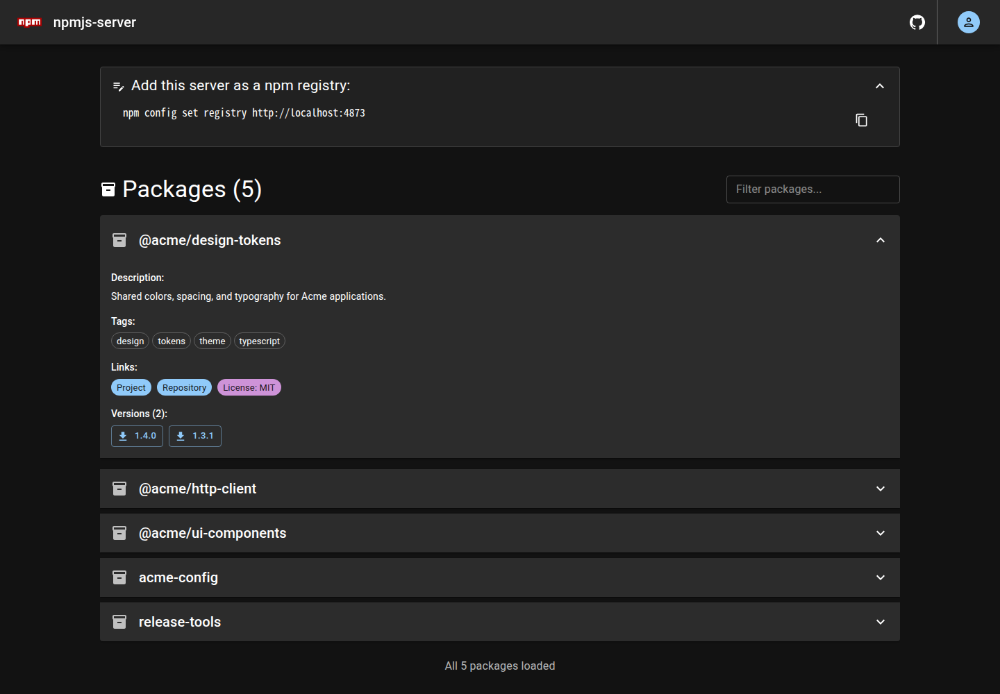
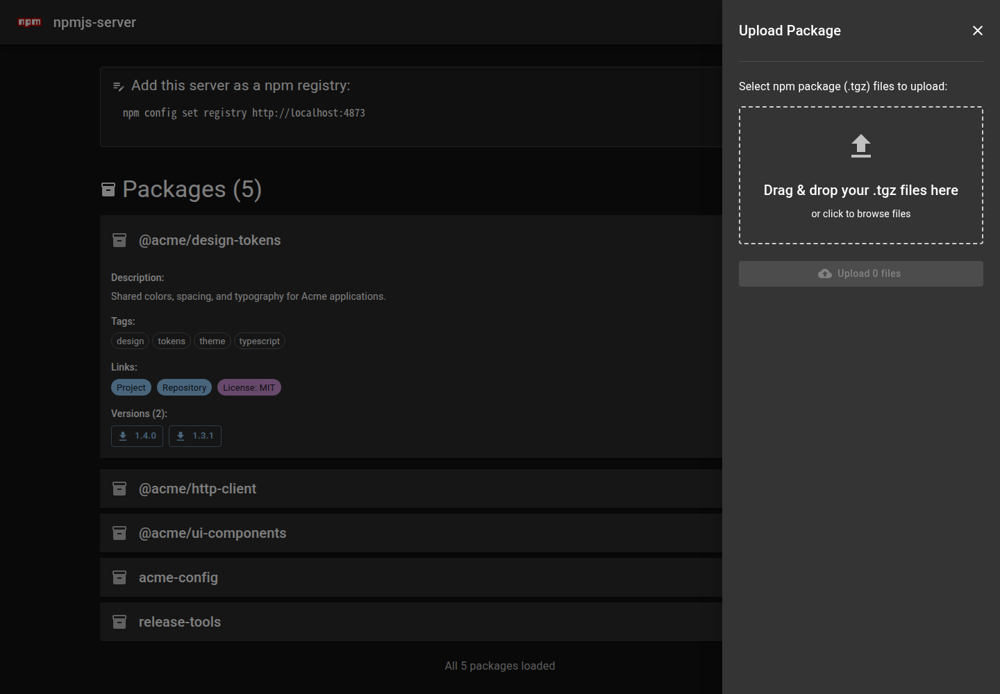
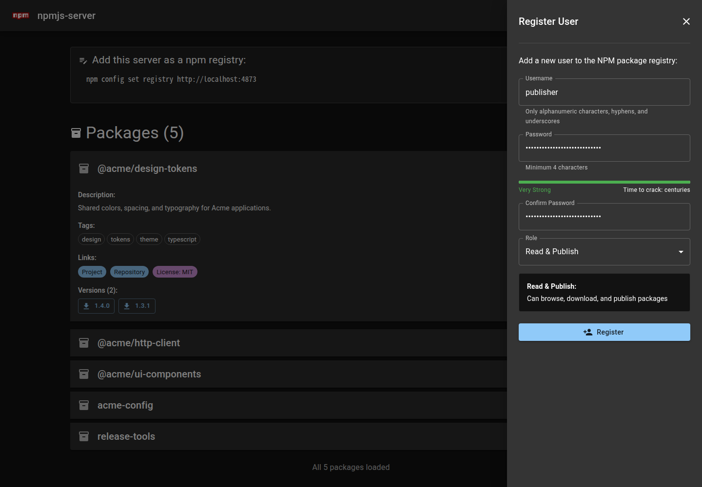
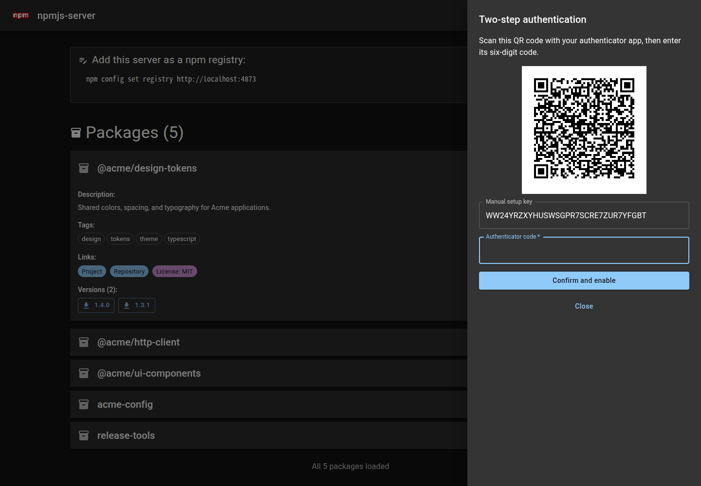
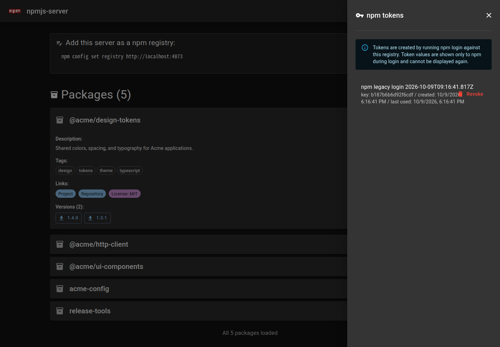

# npmjs-server

Node.jsで動作する、シンプルなプライベートNPMレジストリ


[](https://www.repostatus.org/#wip)
[](https://opensource.org/licenses/MIT)
[](https://www.npmjs.com/package/npmjs-server)
[](https://hub.docker.com/r/kekyo/npmjs-server)

---

[(English language is here)](./README.md)

## これは何？

社内や個人の環境でNPMパッケージを保管・配布するためのサーバーです。標準のnpmクライアントから、パッケージの公開、検索、インストールを行えます。

パッケージとユーザー情報はファイルに保存するため、データベースの用意は不要です。スコープ付きパッケージと、スコープなしのパッケージの両方に対応しています。

ブラウザーから操作できる管理UIも備えています。

- パッケージ一覧、バージョン、READMEなどの情報を表示
- バージョンを指定したパッケージのダウンロード
- 複数の`.tgz`ファイルのドラッグ＆ドロップによる公開
- ユーザーの追加・削除、パスワードの変更・リセット
- npmトークンの確認・失効と、二段階認証の設定

パッケージ一覧（デモデータ）



パッケージの公開



ユーザーの登録



### 主な機能

- npmクライアントとの連携。`npm publish`、`npm install`、`npm search`、`npm dist-tag`などに対応
- データベース不要のファイルベースストレージ
- 用途に応じて選べる、認証なし・公開時のみ認証・読み取りを含む認証の3モード
- ユーザーごとの二段階認証。認証アプリのQR登録、確認コード、復旧コードに対応
- 上位npmレジストリへの読み取り専用プロキシとパッケージキャッシュ
- 固定の公開URLや転送ヘッダーを使ったリバースプロキシとの連携
- DockerまたはPodmanでの実行

## 動作環境

Node.js 20.19.0以降が必要です。管理UIはブラウザーから利用できます。

コンテナーで実行する場合は、ホストへのNode.jsのインストールは不要です。[Dockerの使用](#dockerの使用)を参照してください。

---

## インストール

```bash
npm install -g npmjs-server
```

## 使用方法

```bash
# デフォルトのポート4873で起動
npmjs-server

# ポートを変更
npmjs-server --port 3000

# 設定ファイルとパッケージの保存先を指定
npmjs-server --port 4873 --config-file ./config.json --package-dir ./packages
```

起動後、`http://localhost:4873/`をブラウザーで開くと管理UIを利用できます。ポートを変更した場合は、そのポートでアクセスしてください。

初期状態では認証が無効で、パッケージの読み取りと公開を誰でも行えます。利用者を制限する場合は、[認証機能](#認証機能)を設定してください。

## npmクライアントの設定

レジストリは、コマンドごとに指定できます。

```bash
npm install your-package --registry http://localhost:4873/
npm view your-package --registry http://localhost:4873/
npm search your-package --registry http://localhost:4873/
```

普段使うレジストリにする場合は、npmの設定を変更します。

```bash
npm config set registry http://localhost:4873/
```

プロジェクト単位で設定する場合は、そのプロジェクトの`.npmrc`に次の内容を保存してください。

```ini
registry=http://localhost:4873/
```

特定のスコープだけをこのサーバーから取得する場合は、代わりに次のように指定します。

```ini
@myorg:registry=http://localhost:4873/
```

この場合、`@myorg/example`はnpmjs-serverから、それ以外のパッケージはnpmの既定のレジストリから取得します。
`.npmrc`の詳細は[npmの公式ドキュメント](https://docs.npmjs.com/cli/v11/configuring-npm/npmrc/)を参照してください。

npmjs-serverをすべてのパッケージの取得先にする場合、npmjs.orgのパッケージも取得するには[上位npmレジストリへのプロキシ](#上位npmレジストリへのプロキシ)を有効にします。

### パッケージの公開

認証が有効なサーバーでは、最初にログインします。ブラウザーでログインする方法と、端末内で入力する方法に対応しています。

```bash
npm login --registry http://localhost:4873/

# 端末内でログインする場合
npm login --auth-type=legacy --registry http://localhost:4873/
```

パッケージのディレクトリで、次のコマンドを実行します。

```bash
npm publish --registry http://localhost:4873/
```

`npm pack`で作成した`.tgz`ファイルも公開できます。

```bash
npm publish ./example-package-1.0.0.tgz --registry http://localhost:4873/
```

管理UIでは「パッケージをアップロード」からファイルを選択するか、複数の`.tgz`ファイルをドラッグ＆ドロップして公開できます。

同じパッケージ名・バージョンが存在する場合、既定では既存のパッケージを維持します。
`duplicatePackagePolicy`で、上書きする`overwrite`、既存の内容を維持する`ignore`、エラーにする`error`を選べます。

アップロード要求の上限は既定で100MBです。
`maxUploadSizeMb`で変更できます。`npm publish`はアーカイブをBase64でJSONに格納するため、アーカイブのサイズより大きな上限が必要です。

---

## パッケージストレージの設定

### ストレージの場所

パッケージは既定で、起動ディレクトリの`./packages`に保存します。保存先は`--package-dir`、環境変数`NPMJS_SERVER_PACKAGE_DIR`、または`config.json`の`packageDir`で変更できます。

```bash
npmjs-server --package-dir /srv/npmjs-server/packages
```

### パッケージストレージのレイアウト

```text
packages/
  package-name/
    1.0.0/
      package.json
      metadata.json
      package-name-1.0.0.tgz
    dist-tags.json
  @scope/
    package-name/
      1.0.0/
        package.json
        metadata.json
        package-name-1.0.0.tgz
      dist-tags.json
```

バージョンごとにアーカイブとパッケージ情報を保存します。
`dist-tags.json`はタグを明示的に保存した場合に作成します。プロキシで取得したパッケージは、通常のパッケージとは別の`proxy.packageDir`に保存します。

### バックアップとリストア

サーバーを停止してから、次のファイルとディレクトリをまとめてバックアップしてください。

- `packageDir`で指定したパッケージの保存先
- `config.json`と、別途管理している環境変数などの設定
- 認証を使用している場合は`users.json`
- 二段階認証を使用している場合は`totp.key`
- プロキシのキャッシュを維持する場合は`proxy.packageDir`

復元時はサーバーを停止し、ファイルを配置してから保存先の設定とアクセス権を確認して再起動します。
保存先を個別に変更している場合は、その場所もバックアップ対象に含めてください。
TOTPを使うユーザー情報と暗号化鍵は、両方が揃っている必要があります。

## 設定

設定の優先順位は、CLIオプション、環境変数、`config.json`、既定値の順です。
指定方法が限られる項目もあります。[設定リファレンステーブル](#設定リファレンステーブル)で確認してください。

`config.json`が存在しない場合は既定値で起動します。設定ファイルは自動作成しません。

## 設定ファイルの構造

既定では、起動ディレクトリの`./config.json`を読み込みます。別の場所を使う場合は、CLIまたは環境変数で指定します。

```bash
npmjs-server --config-file /srv/npmjs-server/data/config.json

# 環境変数で指定する場合
NPMJS_SERVER_CONFIG_FILE=/srv/npmjs-server/data/config.json npmjs-server
```

設定ファイル内の相対パスは、`config.json`があるディレクトリを基準に解決します。CLIや環境変数の相対パスは起動ディレクトリが基準です。

### config.jsonの構造

すべての項目は省略できます。次の例では、パッケージの公開に認証を要求します。起動前に、次の[初期化](#初期化)で管理者を作成してください。

```json
{
  "port": 4873,
  "packageDir": "./packages",
  "usersFile": "./users.json",
  "realm": "Private npm registry",
  "logLevel": "info",
  "authMode": "publish",
  "passwordMinScore": 2,
  "passwordStrengthCheck": true,
  "duplicatePackagePolicy": "ignore",
  "maxUploadSizeMb": 100,
  "totpKeyFile": "./totp.key",
  "proxy": {
    "enabled": false,
    "upstreamRegistry": "https://registry.npmjs.org",
    "packageDir": "./proxy-packages"
  }
}
```

設定ファイルはJSON形式です。コメントや末尾のカンマは使用できません。

## 認証機能

`authMode`で、パッケージへのアクセスを制限できます。

| モード | 読み取り・検索・ダウンロード | 公開・タグの変更 |
| --- | --- | --- |
| `none`（既定） | 認証不要 | 認証不要 |
| `publish` | 認証不要 | `publish`または`admin`権限が必要 |
| `full` | ログインが必要 | `publish`または`admin`権限が必要 |

ログイン画面やヘルスチェックは、`full`でも認証なしでアクセスできます。ユーザー管理などの管理操作には、別途ログインと必要な権限が求められます。

### 初期化

最初に管理者アカウントを作成します。

```bash
npmjs-server --config-file ./config.json --auth-init
```

ユーザー名、パスワード、確認用のパスワードを対話形式で入力します。
既定では`config.json`と同じディレクトリに`users.json`を作成します。既存のユーザーファイルは上書きしません。

このコマンドはユーザーの作成後に終了します。認証モードの変更やサーバーの起動は行いません。
設定ファイルで`authMode`を指定するか、次のように起動してください。

```bash
npmjs-server --config-file ./config.json --auth-mode publish
```

### セッション例

```text
$ npmjs-server --auth-init
Enter admin username: admin
Enter password: ********
Confirm password: ********
```

初期化後にサーバーを起動し、ブラウザーまたはnpmクライアントで、作成したアカウントにログインします。

```bash
npm login --registry http://localhost:4873/
npm whoami --registry http://localhost:4873/
```

### ユーザーの管理

管理者は管理UIからユーザーの追加・削除とパスワードのリセットを行えます。各ユーザーは自分のパスワードを変更できます。


| 権限 | 許可される操作 |
| --- | --- |
| `read` | パッケージの読み取り・検索・ダウンロード |
| `publish` | `read`の操作に加え、パッケージの公開とタグの変更 |
| `admin` | `publish`の操作に加え、ユーザーの管理 |

権限はレジストリ全体に適用します。
パッケージ単位や組織・チーム単位の権限設定には対応していません。
`npm login`で新規アカウントは作成できないため、管理者が事前にユーザーを登録してください。

### 二段階認証（TOTP）

`authMode`が`publish`または`full`の場合、各ユーザーが二段階認証を設定できます。初期状態では無効です。

1. ログイン後、右上のユーザーメニューから「二段階認証」を開きます。
2. 現在のパスワードを入力し、「認証アプリを登録」を押します。
3. 認証アプリでQRコードを読み取ります。読み取れない場合は「手入力用の登録キー」を入力してください。
4. アプリに表示された6桁の確認コードを入力すると、二段階認証が有効になります。
5. 表示された10個の復旧コードを、安全な場所に保存します。この画面を閉じると再表示できません。



QRコードはブラウザー内で生成します。
[RFC 6238](https://www.rfc-editor.org/rfc/rfc6238.html)のTOTPに対応した認証アプリを使用してください。
設定はSHA-1、6桁、30秒間隔です。

有効化後は、ログイン時にパスワードと確認コードを入力します。
一度使った確認コードは再利用できないため、続けて認証するときは次のコードを待ってください。
確認画面の有効期限は5分、入力は5回までです。失敗を繰り返すと、ユーザー単位と接続元IP単位で最大10分間、試行を制限します。
サーバーと認証アプリの時計を合わせ、公開環境ではHTTPSを使用してください。

端末を紛失した場合は、確認画面で「復旧コードを使う」を選びます。
各コードは1回だけ使用できます。ログイン後の再登録にも、別の確認コードまたは復旧コードが必要です。

「二段階認証」の設定画面では、認証アプリの再登録、復旧コードの再発行、二段階認証の解除を行えます。
いずれも現在のパスワードと、未使用の確認コードまたは復旧コードが必要です。

再登録中は、新しい確認コードを確認するまで現在の認証アプリを使用できます。
登録完了や復旧コードの再発行後は、以前の復旧コードを使用できません。
設定を確定すると、操作中のブラウザーを除くセッションは無効になります。
管理者によるパスワードのリセットでも、TOTPの設定は維持されます。

二段階認証が有効なユーザーは、`npm login`のWeb画面でも確認コードまたは復旧コードを入力します。
`npm login --auth-type=legacy`では、npmの案内に従って確認コードを入力してください。`--otp`オプションでも指定できます。

発行済みのnpmトークンを使った`npm publish`、`npm install`、CIの処理に確認コードは不要です。TOTPを有効にしても、既存トークンを変更する必要はありません。

#### 鍵の保存と復旧

初回登録時に、`config.json`と同じディレクトリへ暗号化鍵`totp.key`を作成します。
保存先は、`config.json`の`totpKeyFile`または環境変数`NPMJS_SERVER_TOTP_KEY_FILE`で指定できます。
環境変数の指定が優先されます。

設定ファイル内の相対パスは`config.json`のディレクトリが基準です。
環境変数には絶対パスを指定すると、起動ディレクトリに左右されません。
保存先のディレクトリは事前に作成してください。

`users.json`のTOTP登録キーは暗号化して保存し、復旧コードはハッシュのみを保存します。
`users.json`と`totp.key`の両方をバックアップし、鍵へのアクセスを制限してください。
コンテナーでは鍵も永続ボリュームに保存します。
セッション用の`sessionSecret`は、この暗号化鍵の代わりにはなりません。
同じユーザーファイルを複数のサーバープロセスから同時に使用する構成には対応していません。

認証アプリも復旧コードも使用できない場合は、サーバーを停止してから、サーバー管理者が対象ユーザーのTOTPをリセットできます。

```bash
npmjs-server --config-file ./config.json --totp-reset alice
```

このコマンドは停止状態を自動判定しません。実行前にサーバーの停止を確認してください。
対象ユーザーのTOTPと復旧コードを削除し、パスワード、npmトークン、他のユーザーは維持します。
再起動後にパスワードでログインし、認証アプリを登録し直してください。

TOTPが有効なユーザーがいる状態で暗号化鍵が失われたり変わったりすると、サーバーは起動しません。
バックアップから元の鍵を復元してください。
鍵を復元できない場合は、TOTPが有効な各ユーザーを上記のコマンドでリセットします。
リセットに暗号化鍵は不要です。破損した鍵ファイルが残っている場合は、全ユーザーのリセット後に取り除いてから再起動してください。

### npmトークンの使用

`npm login`に成功すると、npmクライアントにトークンが保存されます。
その後の公開やダウンロードには、このトークンを使用します。
ログイン方法は[npmの公式ドキュメント](https://docs.npmjs.com/cli/v11/commands/npm-login/)を参照してください。

トークンはログインするたびに発行します。1ユーザーあたり50個まで保持できます。
管理UIのユーザーメニューにある「npm token」を開くと、自分のトークンの一覧、作成日時、最終利用日時を確認し、不要なトークンを失効させられます。
失効は直ちに反映します。トークンの値は管理UIで再表示できません。



CIで使用する場合は、発行したトークンをCIのシークレットとして保存し、[非対話モード（CI/CD）](#非対話モードcicd)のように設定してください。

### パスワード強度要件

既定では、パスワードの推測しにくさを0～4のスコアで評価し、2以上を要求します。
`passwordMinScore`で必要なスコアを、`passwordStrengthCheck`で強度判定の有効・無効を変更できます。

```json
{
  "passwordMinScore": 3,
  "passwordStrengthCheck": true
}
```

強度判定を無効にしても、パスワードは4文字以上必要です。

## 上位npmレジストリへのプロキシ

npmjs.orgなどの上位レジストリからパッケージを取得し、このサーバーを通じて配布できます。既定では無効です。

### プロキシの有効化

`config.json`に次の設定を追加します。

```json
{
  "proxy": {
    "enabled": true,
    "upstreamRegistry": "https://registry.npmjs.org",
    "packageDir": "./proxy-packages"
  }
}
```

CLIから有効にする場合は、次のように指定します。

```bash
npmjs-server --proxy --proxy-upstream-registry https://registry.npmjs.org
```

### プロキシの動作

ローカルと上位レジストリのパッケージ情報をまとめて返します。
同じバージョンやタグが両方にある場合は、ローカルの内容を優先します。
`npm publish`で公開したパッケージを上位レジストリへ転送することはありません。

取得したアーカイブは、通常の`packageDir`とは別の`proxy.packageDir`に保存します。
省略時は、`config.json`と同じディレクトリにある`proxy-packages`を使用します。
キャッシュ済みのパッケージは、上位レジストリに接続できない場合も取得できます。未取得のバージョンは、上位レジストリへの接続が必要です。

管理UIの一覧と`npm search`は、ローカルに公開したパッケージを対象とします。
上位レジストリ全体の検索や、一括ミラーリングは行いません。

### セッション例

プロキシを有効にしてサーバーを起動した後、npmクライアントから公開パッケージを取得できます。

```bash
npm view dayjs version --registry http://localhost:4873/
npm install dayjs --registry http://localhost:4873/
```

`full`モードの場合は、先にこのサーバーへログインしてください。

### プライベートレジストリURLを削除する

プロキシを有効にすると、内部ネットワークで使用するnpmレジストリを一元化できます。
ただし、パッケージの取得元URLがロックファイルに残ります。

npmは、パッケージの取得元URLを`package-lock.json`の`resolved`フィールドに保存します。
プライベートレジストリから`npm install`などでパッケージをインストールすると、そのURLも記録されるため、ファイルをGitにコミットするとURLが外部に漏れる可能性があります。

同じファイルの`integrity`フィールドには、パッケージアーカイブの検証に使うハッシュ値を保存します。
詳細は[npmのロックファイルのドキュメント](https://docs.npmjs.com/cli/v11/configuring-npm/package-lock-json/#packages)を参照してください。
設定済みのレジストリからパッケージを取得できれば、元のダウンロードURLを保持しなくても、このハッシュ値でパッケージの内容を検証できます。

[resolved-killer](https://github.com/kekyo/resolved-killer/)を併用すると、`integrity`による検証を維持したまま、`package-lock.json`からこれらのURLを取り除けます。
これにより、`resolved`フィールドからプライベートレジストリURLが漏れるのを防ぎながら、取得したパッケージの内容を検証できます。

## リバースプロキシとの相互運用性

TLS終端や外部公開にリバースプロキシを使用できます。
公開URLが決まっている場合は、`baseUrl`にブラウザーとnpmクライアントからアクセスするURLを指定してください。

### URLの解決

パッケージのダウンロードURLなどに使用する公開URLは、次の順に解決します。

1. `baseUrl`による固定URL
2. `Forwarded`ヘッダー
3. `X-Forwarded-Proto`、`X-Forwarded-Host`、`X-Forwarded-Port`ヘッダー
4. リクエストのプロトコルと`Host`ヘッダー

```bash
npmjs-server \
  --base-url https://packages.example.com \
  --trusted-proxies 127.0.0.1,::1
```

この例では、クライアントにも同じ公開URLを指定します。

```bash
npm config set registry https://packages.example.com/
```

`trustedProxies`には、実際に使用するプロキシのIPアドレスを指定してください。
CLIと環境変数ではカンマ区切り、JSONでは文字列の配列を使用します。
未指定の場合も、URLの生成では転送ヘッダーを参照します。

HTTPSで公開する場合は`baseUrl`も`https://`で指定してください。
ブラウザーのセッションCookieに付ける`Secure`属性は、この設定に基づきます。
リバースプロキシ側のアップロード上限も、サーバーの`maxUploadSizeMb`に合わせて設定します。

## Dockerの使用

コンテナーイメージは、ポート4873で起動し、パッケージを`/packages`、設定と認証情報を`/data`に保存します。Dockerのほか、Podmanでも実行できます。

### クイックスタート

Linux上のDockerで実行する例です。保存先を作成し、コンテナーから書き込めるようにします。

```bash
mkdir -p data packages
sudo chown -R 1001:1001 data packages

docker run --rm -p 4873:4873 \
  -v "$PWD/data:/data" \
  -v "$PWD/packages:/packages" \
  docker.io/kekyo/npmjs-server:latest
```

`http://localhost:4873/`を開いて利用します。この起動例は認証なしの構成です。

Docker Composeを使う場合は、同じ保存先を用意してから次の`compose.yaml`を使用できます。

```yaml
services:
  npmjs-server:
    image: docker.io/kekyo/npmjs-server:latest
    ports:
      - "4873:4873"
    volumes:
      - ./data:/data
      - ./packages:/packages
    restart: unless-stopped
```

```bash
docker compose up -d
```

### パーミッション要件

コンテナー内では、UID/GIDともに1001のユーザーで実行します。
ホストの保存先ディレクトリには、そのユーザーからの読み書きを許可してください。

rootless Podmanでは、ホスト側のUIDとコンテナー側のUIDが異なります。
所有者を変更する場合は、[podman unshare](https://docs.podman.io/en/latest/markdown/podman-unshare.1.html)でユーザー名前空間内から操作します。

```bash
podman unshare chown -R 1001:1001 data packages
```

### 基本的な使用方法

認証を有効にする場合は、サーバーを起動する前に管理者を作成します。

```bash
docker run --rm -it \
  -v "$PWD/data:/data" \
  docker.io/kekyo/npmjs-server:latest \
  node dist/cli.mjs --config-file /data/config.json --auth-init
```

その後、同じ`data`ディレクトリを使って起動します。

```bash
docker run --rm -p 4873:4873 \
  -e NPMJS_SERVER_AUTH_MODE=publish \
  -v "$PWD/data:/data" \
  -v "$PWD/packages:/packages" \
  docker.io/kekyo/npmjs-server:latest
```

### ボリュームマウントと設定

| コンテナー内のパス | 内容 |
| --- | --- |
| `/packages` | ローカルに公開したパッケージ |
| `/data/config.json` | サーバー設定 |
| `/data/users.json` | ユーザー、npmトークン、TOTPの登録情報 |
| `/data/totp.key` | TOTP登録キーの暗号化鍵。初回登録時に作成 |
| `/data/proxy-packages` | プロキシの既定のキャッシュ保存先 |

`/data`と`/packages`の両方を永続化してください。
TOTP用の鍵を別の場所に変更する場合は、その保存先も永続化します。

イメージの既定の起動コマンドは、`--config-file /data/config.json --package-dir /packages`を指定しています。
これらのCLIオプションは環境変数やJSONより優先されます。
保存先を変える場合は、マウント先に加え、イメージ名の後に指定する起動コマンドも変更してください。

### systemdによる自動起動例

Podmanとsystemdを使用する場合は、[Quadlet](https://docs.podman.io/en/latest/markdown/podman-systemd.unit.5.html)でコンテナーを管理できます。

次の例は、root権限で管理するサービスです。
事前に`/srv/npmjs-server/data`と`/srv/npmjs-server/packages`を用意し、UID/GID 1001のアクセス権を設定して、同じ`data`ディレクトリに管理者を作成してください。

`/etc/containers/systemd/npmjs-server.container`を作成します。

```ini
[Unit]
Description=npmjs-server
Wants=network-online.target
After=network-online.target

[Container]
Image=docker.io/kekyo/npmjs-server:latest
ContainerName=npmjs-server
PublishPort=4873:4873
Volume=/srv/npmjs-server/data:/data
Volume=/srv/npmjs-server/packages:/packages
Environment=NPMJS_SERVER_AUTH_MODE=publish

[Service]
Restart=always
TimeoutStartSec=900

[Install]
WantedBy=multi-user.target
```

```bash
sudo systemctl daemon-reload
sudo systemctl start npmjs-server.service
```

`[Install]`の指定により、次回のシステム起動時にも起動します。

## Dockerイメージのビルド (高度)

ソースからコンテナーイメージを作成する場合は、リポジトリのビルドスクリプトを使用できます。

### Podmanによるマルチプラットフォームビルド（推奨）

Node.js、npm、Podman、`jq`、`curl`が必要です。ホストと異なるアーキテクチャもビルドする場合は、QEMUによるエミュレーションを用意してください。

リポジトリのルートで実行します。

```bash
npm install

# linux/amd64とlinux/arm64のイメージをビルド
./build-docker-multiplatform.sh

# 対象を限定する場合
./build-docker-multiplatform.sh --platforms linux/amd64

# ベースイメージを変更する場合
./build-docker-multiplatform.sh --node-image node:24-trixie-slim
```

スクリプトはアプリケーションをビルドし、各アーキテクチャのイメージで起動を確認します。
既定ではレジストリへプッシュしません。
利用できるオプションは`./build-docker-multiplatform.sh --help`で確認できます。

## 備考

### テスト環境

Linux上のNode.js 24とnpmクライアントで、パッケージの公開・取得と認証を確認しています。
管理UIはChromiumで、コンテナーは`linux/amd64`と`linux/arm64`で確認しています。
非ネイティブのコンテナーにはQEMUを使用しています。

### サポートされるnpmレジストリAPIエンドポイント

npmレジストリAPIのうち、次の操作に対応しています。表の`:package`には、スコープ付きパッケージ名も指定できます。

| メソッド | パス | 操作 |
| --- | --- | --- |
| `GET` | `/-/ping` | 接続確認 |
| `GET` | `/-/whoami` | ログイン中のユーザーの確認 |
| `POST` | `/-/v1/login` | Webログインの開始 |
| `GET` | `/-/v1/login/:id/done` | Webログインの完了確認 |
| `PUT` | `/-/user/org.couchdb.user:<username>` | legacyログイン |
| `GET` | `/-/v1/search` | ローカルパッケージの検索 |
| `GET` | `/:package` | パッケージ情報の取得 |
| `GET` | `/:package/:versionOrTag` | バージョンまたはタグを指定した情報の取得 |
| `GET` | `/:package/-/:tarball` | パッケージのダウンロード |
| `PUT` | `/:package` | パッケージの公開 |
| `GET` | `/-/package/:package/dist-tags` | タグ一覧の取得 |
| `PUT` / `DELETE` | `/-/package/:package/dist-tags/:tag` | タグの設定・削除 |

このほか、`.tgz`を直接公開する`POST /api/publish`と、稼働確認用の`GET /health`があります。

`unpublish`、`deprecate`、provenance、組織・チームの管理には対応していません。
監査用の`/-/npm/v1/security/advisories/bulk`と`/-/npm/v1/security/audits/quick`は空の結果を返します。
脆弱性の検査や上位レジストリへの監査要求の転送は行わないため、`npm audit`の結果だけでは脆弱性の有無を判断できません。

### 非対話モード（CI/CD）

CIでは、事前に`npm login`で取得したトークンを使用します。トークンをCIのシークレットに保存し、環境変数`NPM_TOKEN`として渡してください。

プロジェクトの`.npmrc`には、環境変数の参照を記述します。トークンの値はファイルに書き込まず、CIのシークレットから渡してください。

```ini
registry=https://packages.example.com/
//packages.example.com/:_authToken=${NPM_TOKEN}
```

npmによる環境変数の展開と認証情報の適用範囲は、[.npmrcの公式ドキュメント](https://docs.npmjs.com/cli/v11/configuring-npm/npmrc/)を参照してください。

`--auth-init`は対話入力を前提としています。
CIでは、準備済みのアカウントとトークンを使用してください。TOTPが有効なユーザーのトークンも、確認コードなしで使用できます。

### セッションセキュリティ

ブラウザーのセッションCookieには`HttpOnly`と`SameSite=Strict`を設定します。`baseUrl`がHTTPSの場合は`Secure`も設定します。
セッションの有効期間は通常24時間で、ログイン状態を保持する場合は7日間です。

`sessionSecret`を指定しない場合は、起動ごとにランダムな値を生成します。
固定する場合は、十分にランダムな32文字以上のASCII文字列を環境変数または設定ファイルで指定してください。OpenSSLを使って生成する例です。

```bash
export NPMJS_SERVER_SESSION_SECRET="$(openssl rand -base64 32)"
npmjs-server
```

固定値を使い続ける場合は、生成した値を安全な場所に保存し、次回も同じ値を渡してください。
ブラウザーのログイン状態はサーバーのメモリーにも保持しているため、シークレットを固定しても再起動後にはログインし直す必要があります。
npmトークンはユーザーファイルに保存するため、再起動後も使用できます。

パスワード認証の失敗には段階的な遅延を設けています。
`NPMJS_SERVER_AUTH_FAILURE_DELAY_ENABLED`と`NPMJS_SERVER_AUTH_FAILURE_MAX_DELAY`で調整できます。
TOTPの試行回数制限は別に適用します。

### 存在しないパッケージへの要求に対する応答

指定したパッケージ、バージョン、アーカイブが見つからない場合はHTTP 404を返します。プロキシが有効な場合は、上位レジストリからの取得も試みます。

### 設定リファレンステーブル

優先順位は、CLI、環境変数、`config.json`、既定値の順です。
表の`<configDir>`は、設定ファイルがあるディレクトリを表します。`—`の欄には指定方法がありません。

| CLIオプション | 環境変数 | config.jsonキー | 説明・有効な値 | 既定値 |
| --- | --- | --- | --- | --- |
| `-p, --port <port>` | `NPMJS_SERVER_PORT` | `port` | ポート番号、1～65535 | `4873` |
| `-b, --base-url <url>` | `NPMJS_SERVER_BASE_URL` | `baseUrl` | 外部からアクセスする固定URL | 自動検出 |
| `-d, --package-dir <dir>` | `NPMJS_SERVER_PACKAGE_DIR` | `packageDir` | パッケージの保存先 | `./packages` |
| `-c, --config-file <path>` | `NPMJS_SERVER_CONFIG_FILE` | — | 設定ファイルの場所 | `./config.json` |
| `-u, --users-file <path>` | `NPMJS_SERVER_USERS_FILE` | `usersFile` | ユーザーファイルの場所 | `<configDir>/users.json` |
| `-r, --realm <realm>` | `NPMJS_SERVER_REALM` | `realm` | 認証画面などで使う名称 | `npmjs-server <version>` |
| `-l, --log-level <level>` | `NPMJS_SERVER_LOG_LEVEL` | `logLevel` | `debug`, `info`, `warn`, `error`, `ignore` | `info` |
| `--trusted-proxies <ips>` | `NPMJS_SERVER_TRUSTED_PROXIES` | `trustedProxies` | プロキシのIPアドレス。JSONでは配列 | 未指定 |
| `--auth-mode <mode>` | `NPMJS_SERVER_AUTH_MODE` | `authMode` | `none`, `publish`, `full` | `none` |
| — | `NPMJS_SERVER_SESSION_SECRET` | `sessionSecret` | セッションCookie用のシークレット | 起動時に生成 |
| — | `NPMJS_SERVER_PASSWORD_MIN_SCORE` | `passwordMinScore` | パスワードの最小強度、0～4 | `2` |
| — | `NPMJS_SERVER_PASSWORD_STRENGTH_CHECK` | `passwordStrengthCheck` | 強度判定、`true` / `false` | `true` |
| — | `NPMJS_SERVER_DUPLICATE_PACKAGE_POLICY` | `duplicatePackagePolicy` | `overwrite`, `ignore`, `error` | `ignore` |
| `--max-upload-size-mb <size>` | `NPMJS_SERVER_MAX_UPLOAD_SIZE_MB` | `maxUploadSizeMb` | アップロード要求の上限、1～10000MB | `100` |
| — | `NPMJS_SERVER_AUTH_FAILURE_DELAY_ENABLED` | — | パスワード認証失敗時の遅延、`true` / `false` | `true` |
| — | `NPMJS_SERVER_AUTH_FAILURE_MAX_DELAY` | — | パスワード認証失敗時の最大遅延、ミリ秒 | `10000` |
| — | `NPMJS_SERVER_TOTP_KEY_FILE` | `totpKeyFile` | TOTP登録キーを暗号化する鍵の保存先 | `<configDir>/totp.key` |
| `--proxy` | `NPMJS_SERVER_PROXY_ENABLED` | `proxy.enabled` | 上位レジストリへのプロキシ、`true` / `false` | `false` |
| `--proxy-upstream-registry <url>` | `NPMJS_SERVER_PROXY_UPSTREAM_REGISTRY` | `proxy.upstreamRegistry` | 上位レジストリのHTTP/HTTPS URL | `https://registry.npmjs.org` |
| `--proxy-package-dir <dir>` | `NPMJS_SERVER_PROXY_PACKAGE_DIR` | `proxy.packageDir` | プロキシのキャッシュ保存先 | `<configDir>/proxy-packages` |
| `--totp-reset <username>` | — | — | サーバー停止中に指定ユーザーのTOTPをリセット | — |
| `--auth-init` | — | — | 対話形式で管理者を作成して終了 | — |
| `-h, --help` | — | — | ヘルプを表示 | — |
| `-V, --version` | — | — | バージョンを表示 | — |

---

## その他

このプロジェクトは、[nuget-server](https://github.com/kekyo/nuget-server/)を元にしたnpmレジストリです。
[uplodah](https://github.com/kekyo/uplodah/)とも管理UIや認証機能を共有しています。

## プルリクエスト

プルリクエストを歓迎します。`develop`ブランチからの差分として送ってください。

## ライセンス

Under MIT.

